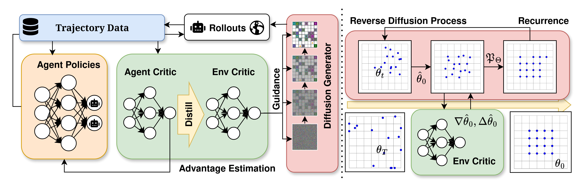

# Diffusion Co-Design

The *agent-environment co-design* paradigm jointly optimises agent policies and environment configurations in search of improved system performance. With application domains ranging from warehouse logistics to windfarm management, co-design promises to fundamentally change how we deploy multi-agent systems. However, current co-design methods struggle to scale. They collapse under high-dimensional environment design spaces and suffer from sample inefficiency when addressing moving targets inherent to joint optimisation. We address these challenges by developing **Diffusion Co-Design (DiCoDe)**, a scalable and sample-efficient co-design framework pushing co-design towards practically relevant settings. DiCoDe incorporates two core innovations. First, we introduce Projected Universal Guidance (PUG), a sampling technique that enables DiCoDe to explore a distribution of reward-maximising environments while satisfying hard constraints such as spatial separation between obstacles. Second, we devise a critic distillation mechanism to share knowledge from the reinforcement learning critic, ensuring that the guided diffusion model adapts to evolving agent policies using a dense and up-to-date learning signal. Together, these improvements lead to superior environment-policy pairs when validated on challenging multi-agent environment co-design benchmarks including warehouse automation, multi-agent pathfinding and wind farm optimisation. Our method consistently exceeds the state-of-the-art, achieving, for example, 39% higher rewards in the warehouse setting with 66% fewer simulation samples. This sets a new standard in agent-environment co-design, and is a stepping stone towards reaping the rewards of co-design in real world domains.

 

## Setup

Git clone this repository and initialise submodules.

`git submodule update --init --recursive`

We use **uv** to manage dependencies. The easiest way to get set up is by running `./scripts/docker_run.sh`, and entering with an interactive shell. Directly setting up on Linux is possible with `uv sync`, but may require additional system installation of packages (see Dockerfile  for reference).

Due to conflicts with `torch-geometric`, `torch-scatter`, and rendering libraries, additionally commands are required. See `scripts/sync.sh`, or slect between vmas and rware environments with

`./scripts/sync.sh --rware` or `./scripts/sync.sh --vmas`.

## Repository Guided Tour

To train a DiCoDe experiment,

1. Train the exploration diffusion model. The entry point can be found in `experiments/train_env_diffusion`, with dataset generation `setup_scenario.py` and diffusion training `train_diffusion.py`.

2. RL loop. The entry point in `experiments/train_env/main.py`, which constructs a TorchRL training loop using the `Trainer` class found in `diffusion_co_design/common/rl/mappo/trainer.py`. See `diffusion_co_design.common.design.DicodeDesigner` and `diffusion_co_design.common.design.ValueDesigner` for the core logic of our method.

Cleanup and detailed instructions for replicating experiments is a work in progress. Currently the codebase does not support directly running the pipeline without edits (e.g. modifying hardcoded links).

## Citation

@misc{li2025scalingmultiagentenvironmentcodesign,
      title={Scaling Multi-Agent Environment Co-Design with Diffusion Models}, 
      author={Hao Xiang Li and Michael Amir and Amanda Prorok},
      year={2025},
      eprint={2511.03100},
      archivePrefix={arXiv},
      primaryClass={cs.LG},
      url={https://arxiv.org/abs/2511.03100}, 
}
