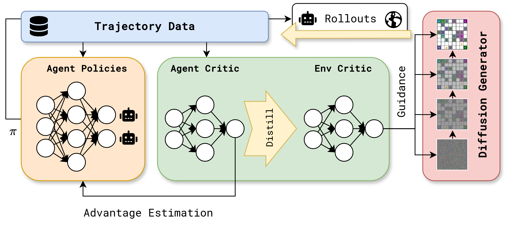

# Diffusion Co-Design

When designing multi-agent systems, the environment --- the world agents interact with --- directly impacts behaviour and performance and must not be overlooked. In this work, we consider the \textbf{agent environment co-design} paradigm, an emerging line of research aiming to learn compatible agent policies and environments. An effective co-design framework has utility in various real-world applications such as logistics and energy systems or creative interpretations of an environment like robot configurations and chip design. While existing work has demonstrated success in specialised applications by leveraging reinforcement learning, various challenges restrict widespread adoption --- in particular, complex and combinatorial environment design spaces lead to an exponential number of valid environments to explore. To tackle this challenge, we propose **diffusion co-design** (DiCoDe), a **scalable** co-design methodology leveraging guided diffusion models to design effective environments for collaborative multi-agent tasks. As part of DiCoDe, we introduce projected universal guidance and a training framework that can share knowledge between a reinforcement learning critic function and an environment generator, enabling us to exploit the representational capabilities of diffusion models to generate constraint-satisfying, controllably diverse and highly rewarding environments. We validate DiCoDe on a diverse set of co-design scenarios modelling warehouse management and wind farm control, resulting in policy-environment pairs that exceed state-of-the-art performance in metrics such as time-to-delivery and power output.

## Setup

We use **uv** to manage dependencies. The easiest way to get set up is to initialise the submodules, and then run `./scripts/docker_run.sh`, and entering with an interactive shell. Note `torch-geometric` needs to be manually installed (see `pyproject.toml`), and RWARE experiments need to be run in headless mode (`./experiments/train_rware/headless.sh`.)